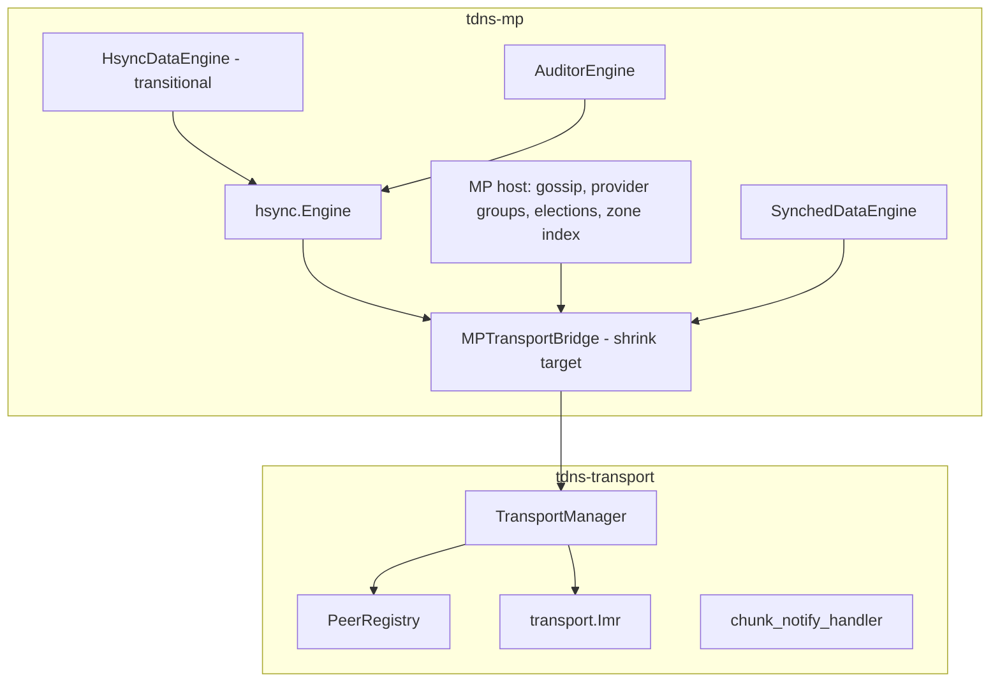
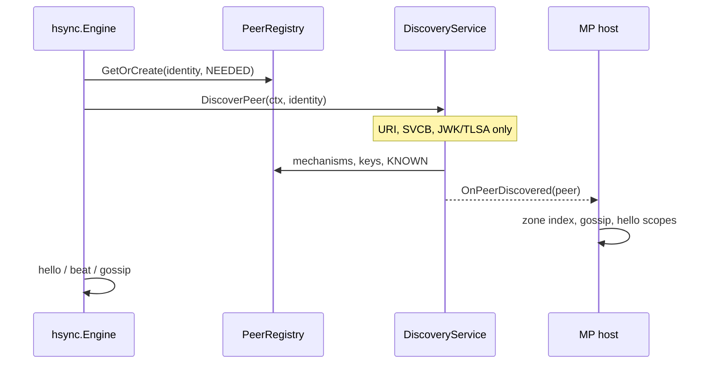

# Transport Redesign: Status and Roadmap (May 2026)

Date: 2026-05-21  
Status: **CURRENT** — authoritative plan for transport boundary work  
Supersedes: [2026-04-15-transport-interface-redesign.md](./2026-04-15-transport-interface-redesign.md)

Related (still useful, not superseded by this doc):

- [2026-04-23-transport-boundary-test-harness.md](./2026-04-23-transport-boundary-test-harness.md) — Phase 0 harness spec
- [2026-04-30-peerregistry-field-disposition.md](./2026-04-30-peerregistry-field-disposition.md) — Phase 1 field-deletion audit (item L)
- [2026-04-30-chunk-notify-handler-split.md](./2026-04-30-chunk-notify-handler-split.md) — Phase 4 cut line (item I)
- [2026-05-19-peer-discovery-engine-extraction.md](./2026-05-19-peer-discovery-engine-extraction.md) — `hsync/` engine extraction (Cut A)

Historical execution logs (bite-by-bite archaeology):

- [2026-04-25-transport-refactor-early-bites.md](./2026-04-25-transport-refactor-early-bites.md)
- [2026-04-30-transport-refactor-semi-easy-bites.md](./2026-04-30-transport-refactor-semi-easy-bites.md)
- [2026-05-08-transport-refactor-next-bites.md](./2026-05-08-transport-refactor-next-bites.md)
- [2026-05-08-transport-refactor-third-bites.md](./2026-05-08-transport-refactor-third-bites.md)

---

## 1. Why this document exists

The April 2026 transport interface redesign remains a valid
**destination sketch**, but the codebase and architecture have
moved on:

- Early bites, the semi-easy tier, and the transport-boundary
  harness are **implemented**.
- Cut A (`hsync/` shared engine, `HsyncDataEngine`, `AuditorEngine`)
  landed **after** that plan was written.
- We temporarily have **three peer-shaped stores** (`transport.Peer`,
  `Agent`, `hsync.Peer`) instead of converging on one.

This document records **agreed goals, as-built state, end state, and
remaining work** as of May 2026. It does not rewrite history in the
April plan or the bite docs; those stay as-is for traceability.

---

## 2. North-star goals

### 2.1 Reusable transport library

`tdns-transport` must be importable by a new application with **no**
dependency on HSYNC RR semantics, MP zones, combiners, signers, or
gossip. Transport delivers **opaque payloads** between authenticated
peers over DNS/API/CHUNK, with a **tiered API** (messaging, hello/beat/
ping/liveness, RMQ/confirmations).

Resolved product choices (unchanged from April plan):

- **Scope** is an opaque string; transport compares scopes only for
  equality; authorization is an app callback.
- **QNAME structure** stays a transport concern; apps do not parse it.
- **Hello** carries `AppName`, `AppVersion`, `Mechanisms`, `Scopes`,
  and opaque `AppData`.
- **Gossip** stays in MP indefinitely (Tier-2 transport gossip is
  optional future work, not a blocker).

### 2.2 Single peer registry (canonical store)

**Goal:** `transport.PeerRegistry` is the **only** map of remote peers.

| Component | Role at end state |
|-----------|-------------------|
| `transport.PeerRegistry` | Canonical peer rows: identity, mechanisms, crypto, transport liveness |
| MP host (today’s `AgentRegistry` **without** a parallel peer map) | Gossip, provider groups, elections, **zone ↔ peer ID index**, local config |
| `hsync.Engine` (MP) | HSYNC protocol loop: who to talk to, when to hello/beat, gossip matrix — **looks up peers by ID in `PeerRegistry`** |

**Not the goal:** one mega-struct that also holds gossip tables or
zone data on every peer.

**Explicit non-goal:** three peer structs kept in sync (`Agent`,
`hsync.Peer`, `transport.Peer`). The `hsync.Registry` peer map and
`AgentRegistry.S` are **transitional** and slated for removal.

Merging “AgentRegistry and PeerRegistry” means: **eliminate the
duplicate peer map and transport-shaped fields on `Agent`**, not
deleting MP host services.

### 2.3 Discovery: transport mechanics, MP triggers

Discovery is **tightly coupled to HSYNC in production** (HSYNC
analysis decides *who* must exist), but **not in implementation**:

| Step | Owner | What happens |
|------|--------|----------------|
| a | MP / `hsync` | HSYNC analysis → need peer identity `peer.foo.bar.` |
| b | **Transport** | URI (`_dns._tcp` / `_https._tcp`) → SVCB → JWK/TLSA; populate `Peer` |
| c | — | Discovery **never** reads HSYNC or HSYNCPARAM RRs |
| d | Any future trigger | Same discovery machinery; only the **caller** changes |

**`hsync.Engine` stays in `tdns-mp`.** Moving discovery to transport
means moving **URI/SVCB/JWK/TLSA and `PeerRegistry` updates**, not
moving HSYNC3 diff logic or gossip.

### 2.4 Regression safety

All seven `TestTransportBoundary_*` scenarios in `tdns-mp/v2/
transport_integ_test.go` remain the **CI gate** for transport-boundary
changes. See the harness doc for scenario definitions.

### 2.5 Target completion level

**L2** (full boundary cleanup as originally envisioned), plus an **L3
fragment** for discovery orchestration in transport. Gossip remains
MP-only (not L3 Tier-2 gossip in transport).

---

## 3. Agreed decisions (May 2026)

| ID | Decision |
|----|----------|
| **D1** | **Discovery orchestration in transport** (`DiscoveryService` / `DiscoverPeer` owns IMR loop, retry, `Peer` population). MP/`hsync` only triggers by identity and handles post-discovery HSYNC work. `DiscoveryDriver` is temporary. |
| **D2** | **Remove `SharedZones` / `ZoneRelation` from `transport.Peer`.** Zone membership is an MP index and/or hello `Scopes`, not transport state. Peers must make sense without zone-centric modeling. |
| **D3** | **Minimal early wire change:** rename `BeatRequest.Gossip` → `AppData` in Go; keep JSON tag `gossip` until a deliberate wire migration (Appendix H normalization can follow on a feature branch). |
| **D4** | **Transport “done” is independent of `HsyncDataEngine` dissolution** (peer-discovery §11). Data-engine shell removal is a separate milestone. |
| **D5** | **Audience:** implementers — concrete milestones and file-level direction; evolution/history via links to superseded docs. |

**Open for a follow-up pass (does not block this doc):** where MP-only
per-peer extras live after `Agent` shrinks — small `PeerAttachment`
side map vs typed extension on `Peer` (e.g. `AppMeta`).

---

## 4. Architecture today (as-built)

### 4.1 Layer diagram



### 4.2 What is already landed

| Area | Status |
|------|--------|
| Transport-boundary harness | **Done** — seven scenarios pass |
| Early bites (0–8) | **Done** — mechanisms on `Peer`, `Agent.PeerID`, `PopulateFromAgent`, `OnPeerDiscovered`, `tm.Send` (sync), `transport.Imr`, `GetOrCreatePeer`, etc. |
| Semi-easy bites (I, C, D, E, F, G, H) | **Done in tree** — see bite docs for archaeology |
| Specs for field deletion + chunk split | **Done** — peerregistry + chunk-notify docs |
| Cut A `hsync/` engine | **Done in tree** — shared engine; agent/auditor wired |
| `DiscoverPeer` + `DiscoveryDriver` | **Partial** — API exists; body still `DiscoverAndRegisterAgent` (MP registration bundled) |

### 4.3 The three-registry problem (technical debt)

| Store | Type | Problem |
|-------|------|---------|
| `TransportManager.PeerRegistry` | `*transport.Peer` | Intended canonical store |
| `AgentRegistry.S` | `*Agent` | Duplicates transport + protocol state |
| `hsync.Registry.S` | `*hsync.Peer` | Near-copy of `Agent`; Cut A staging |

`TransportBridge` already returns `*transport.Peer` from `DiscoverPeer`
but hello/beat paths still thread `*hsync.Peer` through `mpHsyncBridge`
with copy/sync helpers. **End state removes the two MP-side peer maps.**

### 4.4 Discovery flow today vs target

**Today:** `hsync` calls `DiscoverPeer` → `DiscoveryDriver.RunDiscovery`
→ `DiscoverAndRegisterAgent` → IMR + **`RegisterDiscoveredAgent`**
(updates `PeerRegistry` **and** `AgentRegistry`).

**Target:**



---

## 5. End state (definition of done)

**Transport redesign complete (L2)** when all of the following hold:

1. `tdns-transport` exports **no MP-specific types** (`SyncType`,
   `Dns*Payload` with HSYNC fields, etc. live in `tdns-mp/v2` per
   Appendix H in the superseded plan).
2. **CHUNK handler** reassembles/decrypts and invokes an app callback
   with `(senderID, rawPayload)` per
   [chunk-notify-handler-split.md](./2026-04-30-chunk-notify-handler-split.md).
3. **`MPTransportBridge` removed** — MP holds `*transport.TransportManager`
   and wires components at startup.
4. **Single peer map** — `PeerRegistry` only; `hsync.Registry.S` and
   `AgentRegistry.S` eliminated or reduced to non-authoritative views.
5. **Legacy single-state fields on `Peer` deleted** per
   [peerregistry-field-disposition.md](./2026-04-30-peerregistry-field-disposition.md).
6. **`SharedZones` / `ZoneRelation` removed from `transport.Peer`** (D2).
7. **Discovery** runs in transport (URI → SVCB → JWK/TLSA); MP triggers
   by identity only (D1).
8. Hello/beat liveness updates centralized in **transport middleware** or
   stable TM APIs (parallel-send semantics resolved).
9. All seven **`TestTransportBoundary_*`** scenarios still pass.

**Out of scope for “transport done”:** dissolving `HsyncDataEngine`;
full Appendix H wire normalization (may proceed on a branch per D3/D4);
optional Tier-2 gossip in transport.

---

## 6. Work streams (remaining)

Grouped by **outcome**, not old phase numbers. Order is recommended,
not mandatory.

| Stream | Outcome | Notes |
|--------|---------|-------|
| **S0 — Doc hygiene** | Rollback/abort criteria; refresh `hsync_transport.go` disposition table (~53 methods) | Was open items N, O in April plan |
| **S1 — Discovery in transport** | Move IMR discovery + `Peer` population out of `DiscoverAndRegisterAgent`; `OnPeerDiscovered` = MP-only; delete `DiscoveryDriver` | Implements D1; unblocks one registry |
| **S2 — Collapse peer maps** | `hsync` uses `*transport.Peer` / peer ID; delete `hsync.Peer` + `Registry.S`; shrink `Agent` / `AgentRegistry.S` | Largest structural milestone |
| **S3 — Peer field cleanup (B)** | Delete dual-written legacy fields on `Peer` per peerregistry audit | Harness between fields if needed |
| **S4 — Scope fields (D2)** | Remove `SharedZones`/`ZoneRelation` from `Peer`; zone index on MP host only | Third-bites α in old doc is **obsolete** (wrong field types) |
| **S5 — Type migration** | Move MP wire types out of transport API (Appendix H) | Wire breaks on branch per interop policy |
| **S6 — CHUNK split** | Execute chunk-notify spec | Phase 4 |
| **S7 — Send / lifecycle** | Hello/beat parallel-send in TM; router registration on TM startup | Phase 5 residue |
| **S8 — Bridge deletion** | Extract trackers (DNSKEY, RFI), dispatcher, enqueue helpers; delete `MPTransportBridge` | Phase 7 |
| **S9 — Data engine shell** | `HsyncDataEngine` → SDE/direct hooks (peer-discovery §11) | Parallel to S8; D4 |

**Suggested sequencing:** S0 → S1 → S2 → S3 → S4, with S5–S8 in
parallel where dependencies allow. S1+S2 are the architectural unlock
for the single-registry north star.

**Rough calendar per stream** (one focused developer, see §11):

| Stream | Duration |
|--------|----------|
| S0 | 0.5 day |
| S1 | 1–1.5 weeks |
| S2 | 2–3 weeks |
| S3 | 1.5–2 weeks |
| S4 | 3–5 days |
| S5 | 2–4 weeks |
| S6 | 1–2 weeks |
| S7 | ~1 week |
| S8 | 2–3 weeks |
| S9 | 1–2 weeks (optional; D4) |

---

## 7. `hsync.Engine` and transport: division of labour

### 7.1 MP / `hsync` owns

- HSYNC3 RRset diff → **identities** to ensure / remove
- **Zone ↔ peer ID index** (not inside discovery)
- When to call `DiscoverPeer` and retry policy at protocol level
- Hello / beat / gossip / group operational checks
- Provider groups and gossip state tables
- Inbound message dispatch to role handlers

### 7.2 Transport owns

- `PeerRegistry` lifecycle (NEEDED → DISCOVERING → KNOWN, …)
- **Discovery mechanics:** URI, SVCB, JWK, TLSA via `transport.Imr`
- Per-mechanism addresses, keys, stats (canonical — delete duplicates
  on `Agent` / `hsync.Peer`)
- Send paths, CHUNK, RMQ, confirmations, crypto
- `OnPeerDiscovered` / `OnDiscoveryFailed` **callbacks** (transport
  invokes; MP implements)

### 7.3 API sketch (target)

```go
// Transport — no zone, no HSYNC types
func (tm *TransportManager) DiscoverPeer(ctx context.Context, identity string) (*Peer, error)

// MP / hsync — policy only
func (e *Engine) EnsurePeerNeeded(id PeerID)
func (host *MPHost) AssociatePeerWithZone(id PeerID, zone ZoneName)
// → calls tm.DiscoverPeer; on success MP OnPeerDiscovered attaches zones/scopes
```

---

## 8. Document map

| Document | Use |
|----------|-----|
| **This file** | Current goals, architecture, milestones |
| `2026-04-15-transport-interface-redesign.md` | Historical plan, Appendix H, disposition table draft, design principles |
| `2026-04-23-transport-boundary-test-harness.md` | Harness scenarios and CI gate |
| `2026-04-30-peerregistry-field-disposition.md` | Authoritative for S3 deletions |
| `2026-04-30-chunk-notify-handler-split.md` | Authoritative for S6 |
| `2026-05-19-peer-discovery-engine-extraction.md` | Cut A history; `HsyncDataEngine` transitional (§11) |
| `2026-04-25` … `2026-05-08` bite docs | Implementation archaeology only |

---

## 9. Evolution summary (for readers of the old plan)

| April 2026 assumption | May 2026 reality |
|---------------------|------------------|
| Discovery retry in MP (`DiscoveryRetrierNG`) | Retry split: transport backoff on `Peer`; `hsync` protocol retry |
| Two registries → converge | Three registries temporarily; **one `PeerRegistry` north star** |
| Phase 6 part 2 = move discovery body to transport | **Mechanics** in transport; **triggers + zones** in `hsync` |
| `OnPeerDiscovered(peerID string)` | `func(*Peer)` — done |
| Open items I, L | Closed by April-30 spec docs |
| Open items N, O | Still open → stream S0 |

---

## 10. Preliminary risk assessment

**Status:** rough order-of-magnitude (May 2026). Expect **±40–50%**
error on calendar; LOC figures are **churn** (add + delete), not net
growth. Baseline scale: `hsync_transport.go` ~2.3k LOC,
`tdns-mp/v2/hsync/` ~2k LOC, `tdns-transport/v2/transport/` ~9.3k LOC
total; ~47 methods on `MPTransportBridge`; ~40+ files reference
`Agent` / `AgentRegistry` in `tdns-mp/v2`.

### 10.1 High — schedule and correctness

| Risk | Why it hurts | Mitigation |
|------|----------------|------------|
| **S2 — one registry** | Three parallel peer models; `hsync_bridge` copy/sync; `Agent` vs `transport.Peer` state divergence (`LEGACY` in hsync only) | Land S1 first; no new `hsync.Peer` features; harness + agent/auditor interop; consider auditor-before-agent validation (Cut A pattern) |
| **S5 — type migration** | Wire-critical `Dns*Payload` surface; large `dns.go` / `handlers.go`; import churn in both repos | Dedicated branch; Appendix H checklist; defer if interop freezes `main` |
| **S8 — bridge deletion** | ~2.3k LOC bridge; startup in four binaries; many `route*` paths | Only after S5–S7; incremental extractions (trackers, dispatcher) before deleting shell |

### 10.2 Medium

| Risk | Why it hurts | Mitigation |
|------|----------------|------------|
| **S1 — discovery split** | `RegisterDiscoveredAgent` updates Agent + Peer today; IMR late-start races | Transport-only peer writes; MP body only in `OnPeerDiscovered`; extend harness if needed |
| **S3 — field deletion** | `db_hsync.go` legacy peer fields; beat/stats need mechanism-aware helpers first (peerregistry Groups B–C) | Follow audit PR order; one field group per commit |
| **S7 — hello/beat parallel send** | Not primary-then-fallback; combiner/signer still touch `peer.State` | Resolve semantics in TM before deleting bridge wrappers |
| **Legacy discovery path** | `agent_utils.attemptDiscovery` fallback when `HsyncEngine` nil | Remove or guard during S2; grep before merge |

### 10.3 Lower

| Risk | Notes |
|------|--------|
| **S4 — scope fields** | Mostly transport + few MP sites; compiler catches misses |
| **S6 — CHUNK split** | Bounded ~580-line file; spec exists |
| **D3 — AppData rename** | Small; keep JSON tag `gossip` |
| **Harness coverage** | Seven scenarios may need extension after S1 (discovery-only paths) |

### 10.4 Non-technical

| Risk | Notes |
|------|--------|
| **Interop / branch freeze** | peer-discovery §5.0 policy can add **weeks of calendar** without LOC if `main` cannot take merges |
| **Staffing** | S5 and S2 overlap poorly for one person; two developers can shorten calendar but increase integration risk |

### 10.5 Original stream risks (retained)

| Risk | Mitigation |
|------|------------|
| S1 lands but S2 delayed → dual registration persists | S2 explicit milestone immediately after S1; freeze `hsync.Peer` |
| Field deletion (S3) wrong replacement | One field per commit; re-run harness |
| Wire break (D3) during interop freeze | Keep tag `gossip` until branch merge allowed |
| Disposition table stale | S0 updates table or deletes it when bridge is gone |

---

## 11. Effort and size estimates (preliminary)

### 11.1 Calendar summary

| Scope | One focused developer | Verdict |
|-------|----------------------|---------|
| **Doc hygiene only (S0)** | ~0.5 day | Fits in **1 day** |
| **Single small slice** (e.g. D3 `AppData` rename, S4 alone) | ~0.5–1 week | **Not** the full architecture |
| **S1 only** (discovery in transport) | ~1–1.5 weeks | **~1 week** if scope is strictly S1 |
| **North star minimum** (S1 + S2 + S3 + S4) | ~4–6 weeks | **~1 month** for registry + discovery + peer cleanup |
| **Full L2** (S1–S8, successor §5) | ~2–3 months | **Not** 1 day or 1 week |

**Rule of thumb:**

- **1 day** → S0, or one trivial code bite, not the revised architecture.
- **1 week** → S1 started/finished, or S3 Group A only — not one registry.
- **1 month** → S1–S4 (architecture in operation); L2 finish (S5–S8) still ahead.

### 11.2 LOC by stream (churn)

Lines **touched** (added + deleted), approximate. **Net** = approximate
change in repo size after the stream.

| Stream | Δ added | Δ deleted | Net | Primary touch points |
|--------|---------|-----------|-----|----------------------|
| **S0** | 0 | 0 | 0 | Docs only |
| **S1** | 350–500 | 150–250 | +100–250 | New transport discovery; shrink `agent_discovery.go` (~390 LOC), bridge |
| **S2** | 300–500 | 1,200–1,800 | **−700–1,300** | `hsync/` ~2k, `hsync_bridge` ~300, `Agent` peer fields |
| **S3** | 150–300 | 400–700 | −250–500 | `peer.go` ~720; peerregistry audit (6 PR-sized units) |
| **S4** | 50–100 | 150–250 | −100–200 | `SharedZones` / `ZoneRelation` in transport + MP |
| **S5** | 2,000–3,000 | 2,000–3,000 | ~0 | Move types; `dns.go` ~1.5k, `handlers.go` ~900 |
| **S6** | 400–600 | 200–400 | 0–200 | `chunk_notify_handler.go` ~580 |
| **S7** | 200–400 | 300–500 | −100–300 | Hello/beat + TM startup; part of bridge |
| **S8** | 800–1,200 | 2,000–2,300 | **−1,200–1,500** | Most of `hsync_transport.go`; new dispatcher/trackers |
| **S9** | 100–300 | 200–400 | −100–200 | Separate milestone (D4) |

**Full L2 (S1–S8) cumulative churn:** ~**8,000–15,000** lines touched
across `tdns`, `tdns-transport`, `tdns-mp`.

**Full L2 net LOC:** likely **~1,500–3,000 fewer** lines in mp +
transport (bridge and duplicate peer models removed).

### 11.3 Recommended implementation phases

| Phase | Streams | Calendar (serial) | Delivers |
|-------|---------|-------------------|----------|
| **A** | S0 + S1 | 1–1.5 weeks | Discovery mechanics in transport; MP callback-only registration |
| **B** | S2 | 2–3 weeks | Single `PeerRegistry`; `hsync` on `*transport.Peer` |
| **C** | S3 + S4 | 1.5–2 weeks | Legacy `Peer` fields gone; scope off transport peer |
| **D** | S5 + S6 | 3–5 weeks | MP types out of transport API; CHUNK split |
| **E** | S7 + S8 | 2–4 weeks | Bridge gone; L2 checklist complete |

**Phase A+B+C** ≈ **one month** → revised architecture **in operation**.  
**Phase D+E** ≈ **another 1–2 months** → **L2 done** per §5.

S5 and S6 can overlap in phase D if two people and stable interfaces;
S2 should not be parallelized with S5 for a single developer.

### 11.4 Leverage and unknowns

**Highest leverage / highest risk:** **S2** (one registry). **S1** is
smaller but unlocks S2. **S8** is large deletion but lower conceptual
risk if S5–S7 extractions land first.

**Unknowns that could push beyond 3 months:**

- Hidden `Agent` dependencies outside `tdns-mp/v2` (CLI/API moderate today).
- Forced early full Appendix H wire migration on `main`.
- Production regressions on auditor/agent symmetry requiring S2 rework.

---

## 12. Next actions

1. Supersession banner on `2026-04-15-transport-interface-redesign.md`
   — **done** (2026-05-21).
2. Optional: one-line “superseded / see …” headers on bite docs only.
3. Choose scope boundary for scheduling: **month 1 = S1–S4** vs
   **full L2 by date X**; then start **S0** or **S1** on the active
   branch per interop policy.
