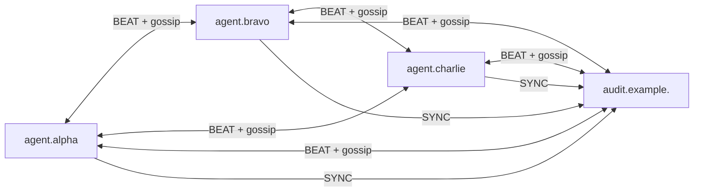

# The Auditor

`tdns-mpauditor` is the multi-provider system's read-only
observer. It joins the network the same way a regular
provider does — it has a DNS identity, an HSYNC3 entry
in each zone it audits, it participates in BEAT/gossip,
and it receives SYNC messages — but it never contributes
any zone data of its own. It exists to *see* what is
happening across the network.

The auditor's value is independence. A combiner sees its
own provider's view; an agent sees its provider's
contributions and what peers have sent it. The auditor
sees what *every* participant claims, what *every* SYNC
carries, and what *every* confirmation reports —
without being part of the production path. This makes it
the natural place to detect divergence, missed
confirmations, suspicious key activity, or providers
silently dropping data.

## 1. Where the Auditor Fits

For the example.com setup (alpha signing+serving, bravo
and charlie serving only), adding an auditor makes the
gossip matrix 4×4:



The auditor receives SYNCs from every agent (so it sees
every change passing through the network) and
participates in gossip (so it sees every BEAT and the
liveness view each agent reports). It sends no SYNCs and
contributes nothing to any combiner.

## 2. Adding the Auditor to a Zone

Two changes to the customer zone:

```
; Add an HSYNC3 record for the auditor
example.com.   HSYNC3       ON  auditor  audit.example.  .

; List the auditor in HSYNCPARAM auditors=
example.com.   HSYNCPARAM   servers="alpha,bravo,charlie" signers="alpha" auditors="auditor" nsmgmt="agent" parentsync="agent"
```

Then bump the zone so every combiner picks up the change:

```sh
tdns-cli auth zone bump -z example.com.
```

The `auditors=` key in HSYNCPARAM is what tells the
agents that this HSYNC3 entry refers to an auditor (not
a signer or server) — agents include auditors as
mandatory SYNC recipients while not expecting them to
contribute back.

The audit identity (`audit.example.`) follows the same
DNS-discovery model as any agent identity: URI, SVCB and
JWK records published under that name. If the auditor
was generated via `tdns-mpcli configure`, those records
are already being served by the auditor's auto-zone.

## 3. Configuring an Auditor

The simplest path is `tdns-mpcli configure`: when asked
"Also generate a tdns-mpauditor config?" answer yes,
provide an auditor identity, and the same interview
produces a `/etc/tdns/tdns-mpauditor.yaml` config plus
JOSE keypair and TLS cert.

Start it like the other daemons:

```sh
sudo tdns-mpauditor --config /etc/tdns/tdns-mpauditor.yaml &
```

The auditor uses the same management API conventions as
the agent (HTTPS on its own port; default `7056`), and
the mpcli config gets an `mpauditor` entry pointing at
it.

## 4. CLI Surface

All auditor commands hang off `tdns-mpcli auditor` and
target the auditor's management API.

### 4.1 Zones being audited

```
$ tdns-mpcli auditor zones

Zone: example.com.  (4 providers, serial 2026051704)
  Provider                          Signer  Last BEAT     Last SYNC     Gossip
  agent.alpha.example.              true    3s            17s           OPERATIONAL
  agent.bravo.example.              false   5s            17s           OPERATIONAL
  agent.charlie.example.            false   2s            17s           OPERATIONAL
  audit.example.                    false   0s            -             OPERATIONAL
```

`zones` is the most useful one-shot health view from the
auditor's perspective: per zone, every party the auditor
knows about, who is a signer, when each was last heard
from (BEAT), when each last sent a SYNC, and the gossip
state.

`Last SYNC = -` for the auditor's own row is expected
(it never sends SYNC). `Last SYNC = -` for any other
row means the auditor has never received a SYNC from
that provider for that zone — probably a configuration
mismatch in HSYNCPARAM.

### 4.2 Audit event log

The auditor records every protocol-level event:
incoming BEAT, incoming SYNC, gossip state change,
confirmation, key state transition.

```sh
# Most recent 50 events
tdns-mpcli auditor eventlog list

# Filter by zone
tdns-mpcli auditor eventlog list -z example.com.

# Events since a specific time
tdns-mpcli auditor eventlog list --since 2026-05-17T08:00:00Z

# Larger window
tdns-mpcli auditor eventlog list --last 500
```

Output is one line per event with timestamp, type,
zone, originator and a one-line summary.

Clearing the log:

```sh
tdns-mpcli auditor eventlog clear -z example.com.        # one zone
tdns-mpcli auditor eventlog clear --older-than 30d       # rotate
tdns-mpcli auditor eventlog clear --all                  # wipe
```

At least one of `--zone`, `--older-than` or `--all` is
required.

### 4.3 Observations

Observations are anomalies the auditor has *inferred* —
not raw events. Examples: a SYNC was sent to N peers
but only N-1 confirmed; one peer's gossip view of
another is persistently different from everyone else's;
a DNSKEY appeared at one provider's served zone without
a corresponding SYNC.

```sh
tdns-mpcli auditor observations
tdns-mpcli auditor observations -z example.com.
```

Output groups observations by severity (INFO, WARN,
ERROR), zone and provider.

Observations are where the auditor earns its keep — they
turn the raw event stream into actionable signal. The
exact detectors are evolving; for now treat any WARN or
ERROR as something to triage.

### 4.4 Peer and gossip commands

The auditor reuses the same `peer` and `gossip`
subtrees as agents:

```sh
tdns-mpcli auditor peer list
tdns-mpcli auditor peer ping --id agent.alpha.example.
tdns-mpcli auditor peer reset --id agent.alpha.example.

tdns-mpcli auditor gossip group list
tdns-mpcli auditor gossip group state --group g_3a8f1c
```

Behaviour matches the agent equivalents documented in
[Operation and Debugging](operation-and-debugging.md).
In particular `gossip group state` is the way to see
the matrix *from the auditor's vantage point* — useful
when the auditor disagrees with what the agents think
about each other.

### 4.5 Zone listings

```sh
tdns-mpcli auditor zone list
tdns-mpcli auditor zone mplist
```

Same shape as `combiner zone mplist`, but from the
auditor's view. The auditor should show every zone that
includes it in HSYNCPARAM `auditors=`.

## 5. What the Auditor Does Not Do

- **No contributions.** The auditor never sends UPDATE
  to any combiner. If you ever see auditor identity as
  an Origin in `combiner zone edits list`, that is a
  bug.
- **No served zone for customers.** It serves only its
  own auto-zone (for peers to discover it).
- **No participation in leader election votes.**
  Auditors are not eligible to be leader.

These properties are what make the auditor safe to
deploy: it cannot, by design, break the production data
plane.

## 6. Web Interface (Under Development)

A web dashboard for the auditor is in development. It
will surface the same data exposed by `auditor zones`,
`auditor observations` and `auditor eventlog` plus
historical timelines and per-zone state diffs. It is
**not ready for use yet** — for now, the CLI is the
only supported interface.

## 7. See Also

- [Architecture](multi-provider-architecture.md) — where
  the auditor fits in the data flow.
- [Customer Zone Setup](customer-zone-setup.md) —
  HSYNC3 and HSYNCPARAM fundamentals.
- [Operation and Debugging](operation-and-debugging.md)
  — the shared `peer` and `gossip` commands.
- [Synchronization Model](synchronization-model.md) —
  the SYNC messages the auditor observes.
