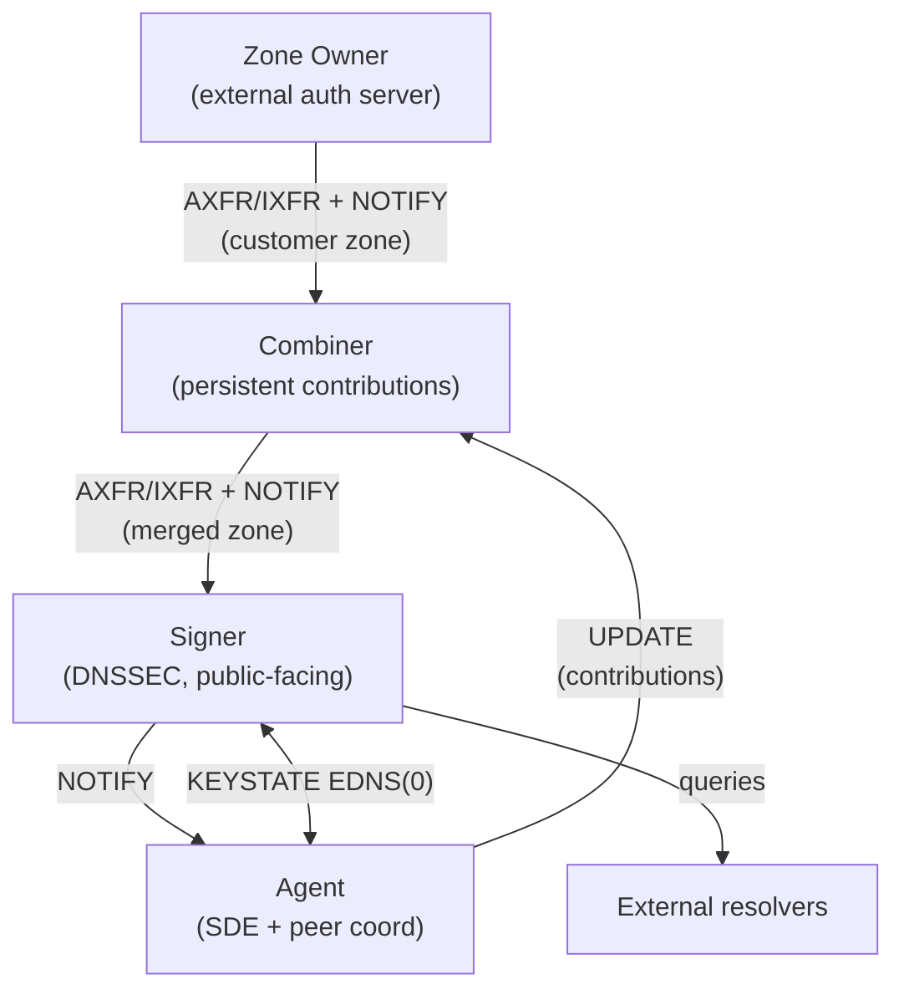
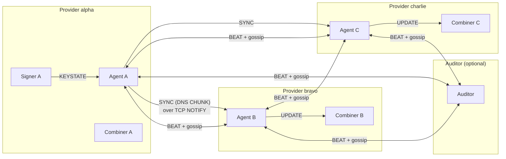

# Multi-Provider Architecture

This document describes *what* tdns-mp is solving and *how*
the pieces fit together. Read this before the operational
guides — most of the CLI output, configuration choices and
failure modes only make sense once the architecture is in
your head.

## 1. The Problem

Running a single DNS zone across two or more independent
providers is harder than it looks. The hard parts are not
the queries; they are everything that *changes*:

- The **apex NS RRset** must list nameservers from every
  provider, and every provider must serve the same set.
- **DNSSEC keys**: when multiple providers sign the zone
  (RFC 8901 multi-signer), each signer publishes its own
  DNSKEYs. Every provider must serve the full union of
  DNSKEYs from all signers, or validation breaks during
  rollovers.
- **CDS / CSYNC**: the records that drive parent-side
  delegation updates. Only one consistent set may be
  published, and it must reflect agreement across
  providers.
- **Operational changes**: adding an NS, rolling a key,
  rotating glue. The change has to propagate to every
  provider's published zone, in a controlled order, with
  confirmation that it actually landed.

Without coordination the choices are either "everyone
edits zone files by hand and prays" or "one provider is
the master and the others are nominal." tdns-mp's job is
to make multi-provider operation a normal mode rather
than a perpetual incident.

## 2. The Three Roles

Each provider runs three coordinated services. They share
the underlying tdns DNS engine, keystore, truststore and
database layer, but each has a distinct job:

| Role     | Binary             | What it owns                                |
|----------|--------------------|---------------------------------------------|
| Combiner | tdns-mpcombiner    | Persistent state for the customer zone     |
| Signer   | tdns-mpsigner      | DNSSEC signing and the public-facing zone  |
| Agent    | tdns-mpagent       | Coordination with other providers           |

A fourth role — the **auditor** (tdns-mpauditor) — is an
optional passive participant. It is covered separately in
[The Auditor](auditor.md).

### 2.1 Combiner

The combiner is the center of persistence for a single
provider. It:

1. Receives the customer zone via inbound zone transfer
   from the zone owner.
2. Merges in **contributions** received from the local
   agent (DNSKEY, NS, CDS, CSYNC, plus any per-provider
   edits authorized by HSYNCPARAM).
3. Publishes the merged zone via outbound zone transfer
   to the local signer.
4. Persists every contribution in its database, attributed
   to its originator. This survives restarts.

The combiner is the only piece that knows the full truth
about "what does *this* provider's published zone contain,
and where did each record come from?".

### 2.2 Signer

The signer is a regular tdns-auth instance configured with
`multi-provider.role: signer`. It:

1. Receives the merged (unsigned) zone via inbound zone
   transfer from the local combiner.
2. Signs it with locally managed DNSSEC keys (online
   signing).
3. Serves the signed zone authoritatively to the world.
4. Coordinates DNSKEY publication state with the local
   agent via the KEYSTATE EDNS(0) option, so that key
   rollovers are consistent across all signing providers.

The signer is the source of truth for *its own* DNSKEYs.
The agent does not derive DNSKEYs from zone transfer data
— it learns them from the signer via KEYSTATE.

### 2.3 Agent

The agent is the per-provider coordinator. It does not
serve the customer zone to end users. It:

1. Watches HSYNC3 and HSYNCPARAM records in each customer
   zone to discover peer agents at other providers.
2. Runs the BEAT/gossip protocol with those peers.
3. Participates in per-group leader elections.
4. Forwards zone updates between the local combiner /
   signer and remote agents over the JOSE-secured CHUNK
   transport.
5. Maintains a runtime cache, the **Synched Data Engine
   (SDE)**, of everything it has learned from peers, the
   local combiner and the local signer.

For the detailed design of the agent's data plane, see
[Synchronization Model](synchronization-model.md).

## 3. Data Flow Inside a Single Provider

Three things travel inside a single provider:

1. **The zone itself**, flowing zone-owner → combiner →
   signer → resolvers. Standard NOTIFY + AXFR/IXFR all
   the way.
2. **Contributions from the agent to the combiner**,
   carried as DNS UPDATE messages. These are the records
   the local provider wants applied (e.g. NS records this
   provider owns, or DNSKEYs from peer providers learned
   via SYNC).
3. **KEYSTATE signaling between signer and agent**, used
   to coordinate DNSKEY publication.

## 4. Data Flow Between Providers

Two distinct things travel between providers:

1. **SYNC**: actual zone data (DNSKEYs from signer A,
   NS records added by agent A, etc.) forwarded
   agent-to-agent so that each remote combiner can apply
   the same contribution. Carried as JOSE-protected
   payloads inside DNS CHUNK records sent via NOTIFY over
   TCP.
2. **BEAT + gossip**: short heartbeats exchanged on a
   regular interval. They confirm liveness *and* piggy-back
   each agent's view of every other agent's state (the
   gossip matrix). This is how the network detects partial
   partitions and decides whether the provider group as a
   whole is OPERATIONAL.

The auditor participates in BEAT/gossip but does not send
SYNC messages — it observes only. With three providers and
one auditor, the gossip matrix is 4×4.

## 5. Identity and Discovery

Each agent (and combiner, signer, auditor) has a DNS
identity — an FQDN under which it publishes the records
needed for peers to find it:

- **URI** record: agent's listening address and port.
- **SVCB** record: agent metadata.
- **JWK** record: agent's long-term JOSE public key, used
  to encrypt SYNC payloads and verify signatures.

The agent generates, publishes and DNSSEC-signs these
records into its own zone (e.g. `agent.alpha.example.`).
For peers to look them up, the agent's zone must be
delegated in the public DNS. See
[Customer Zone Setup](customer-zone-setup.md) for the
HSYNC3 records that bind these identities to a customer
zone.

## 6. Where to Read Next

- [Synchronization Model](synchronization-model.md) — how
  the SDE works, what the combiner persists, how the
  per-RR tracking states behave, and the dynamic
  HSYNCPARAM-derived options.
- [Change Tracking Semantics](mp-change-tracking-semantics.md)
  — the policy corner cases (non-signing providers,
  rejection vs. non-forwarding, etc.).
- [Quickstart](quickstart.md) — bring a working
  three-service deployment up with `tdns-mpcli configure`.
- [Customer Zone Setup](customer-zone-setup.md) — onboard
  an actual zone.
- [Operation and Debugging](operation-and-debugging.md) —
  the CLI commands you live in once it is running.
